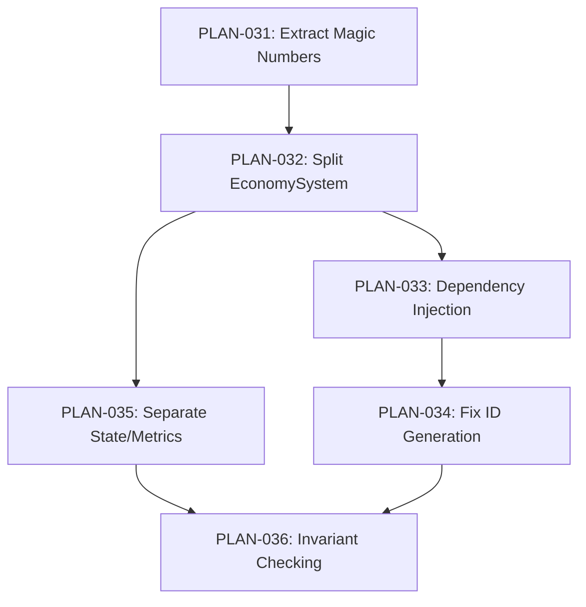

# Architecture Roadmap: Building a Stronger Foundation

**Status:** In Planning
**Date:** January 19, 2026
**Based on:** [01-18-2026 Economy Analysis Report](../sim-analysis/01-18-2026-economy-analysis-report.md)

---

## Executive Summary

The NeoArcology simulation is **stable but fragile**. Recent testing revealed critical architectural issues that must be addressed before adding more features:

1. **2243-line EconomySystem** doing 8+ different things
2. **Global singleton state** blocking testing and concurrent simulations
3. **20+ magic numbers** hardcoded in systems
4. **Non-deterministic ID generation** breaking reproducibility
5. **Mixed simulation state and analytics** causing performance waste
6. **Zero unit tests** - only integration testing via full sim runs

**This roadmap fixes the foundation before building more features.**

---

## The Problem: Technical Debt is Accumulating

### Current State Assessment

| Category | Status | Risk |
|----------|--------|------|
| **Code organization** | 🔴 Critical | Single 2243-line file (EconomySystem) |
| **Testing** | 🔴 Critical | Zero unit tests, only integration tests |
| **Reproducibility** | 🔴 Critical | Module-level ID counters break seeded RNG |
| **State management** | 🟡 Warning | Mixed concerns (state + analytics) |
| **Configuration** | 🟡 Warning | 20+ hardcoded magic numbers |
| **Dependencies** | 🟡 Warning | Global singletons block testing |

### Why This Matters

**Without fixing these issues:**
- Adding new features becomes exponentially harder
- Bugs are harder to track down and fix
- Claude (AI developer) struggles with context and understanding
- Economic tuning requires code changes
- Can't verify simulation correctness
- Can't debug edge cases (no reproducibility)

**With these fixes:**
- Systems are small, focused, and testable
- Economic parameters are data-driven and tunable
- Bugs are caught immediately via invariant checking
- Full reproducibility enables debugging
- Multiple simulations can run concurrently
- Claude can work on small, isolated pieces

---

## The Solution: 6 Architectural Improvements

### Phase 1: Quick Wins (P1 Priority)

These provide immediate value with low risk:

#### PLAN-031: Extract Magic Numbers to Configuration
- **Effort:** 1-2 days
- **Impact:** HIGH - Economic tuning without code changes
- **Risk:** LOW - Pure refactoring, no logic changes

Move 20+ hardcoded constants (thresholds, prices, capacities) into JSON config files.

**Example:**
```typescript
// BEFORE
const EMERGENCY_HUNGER = 80;  // Hardcoded
const restockThreshold = 15;  // Hardcoded

// AFTER (data/config/thresholds.json)
{
  "emergencyHunger": 80,
  "restockThreshold": 15
}
```

**Files:** [PLAN-031-extract-magic-numbers.md](plans/PLAN-031-extract-magic-numbers.md)

---

### Phase 2: Core Architecture (P0/P1 Priority)

Critical refactorings that enable everything else:

#### PLAN-032: Split EconomySystem into Domain Systems ⚠️ CRITICAL
- **Effort:** 3-5 days
- **Impact:** CRITICAL - Maintainability, comprehensibility
- **Risk:** MEDIUM - Large refactoring, requires careful testing

Break the 2243-line monolith into focused systems:
- **AgentEconomicSystem** (~600 lines) - Agent buying, housing, job-seeking
- **BusinessSystem** (~300 lines) - Business opening, opportunity analysis
- **SupplyChainSystem** (~500 lines) - Restocking, orders, delivery
- **PayrollSystem** (~400 lines) - Wages, rent, dividends, dissolution

**Why this matters:**
- Each system becomes understandable in isolation
- Claude can work on one system without loading entire codebase
- Changes don't ripple across unrelated concerns
- Easier to add new economic verticals

**Files:** [PLAN-032-split-economy-system.md](plans/PLAN-032-split-economy-system.md)

---

#### PLAN-033: Replace Global Singletons with Dependency Injection
- **Effort:** 2-3 days
- **Impact:** HIGH - Enables unit testing
- **Risk:** MEDIUM - Touches many files

Replace global `Metrics` and `ActivityLog` singletons with dependency injection via `SimulationContext`.

**Example:**
```typescript
// BEFORE: Global singleton
import { trackDeath } from '../Metrics';
trackDeath(agent.name, 'starvation');  // Global call

// AFTER: Dependency injection
function processAgents(agents: Agent[], context: SimulationContext) {
  context.metrics.trackDeath(agent.name, 'starvation');
}
```

**Benefits:**
- Systems can be tested with mock contexts
- Multiple simulations can run concurrently
- No silent failures from uninitialized singletons
- Seeded RNG moved into context for reproducibility

**Files:** [PLAN-033-dependency-injection.md](plans/PLAN-033-dependency-injection.md)

---

#### PLAN-034: Fix ID Generation for Reproducibility ⚠️ CRITICAL
- **Effort:** 2-3 days
- **Impact:** CRITICAL - Debugging, bug reproduction
- **Risk:** MEDIUM - Requires state structure changes

Move ID generation from module-level counters into `WorldState.idState` for deterministic IDs.

**Current problem:**
```typescript
// Module-level state (non-deterministic!)
let shopNameIndex = 0;
let locationIdCounter = 1;
```

Even with identical seed, execution order affects IDs, making bugs impossible to reproduce.

**Solution:**
```typescript
interface WorldState {
  idState: {
    nextLocationId: number;
    nextOrgId: number;
    nameCounters: { shop: number; pub: number; ... };
  };
}

// Pass through context
context.idGen.nextLocationId();  // Deterministic!
```

**Files:** [PLAN-034-fix-id-generation.md](plans/PLAN-034-fix-id-generation.md)

---

### Phase 3: Advanced Architecture (P1/P2 Priority)

Longer-term improvements for scalability:

#### PLAN-035: Separate Simulation State from Derived Metrics
- **Effort:** 3-4 days
- **Impact:** MEDIUM - Cleaner state, better performance
- **Risk:** MEDIUM - Requires UI updates

Remove analytics fields (`weeklyRevenue`, `profitMargin`, etc.) from entity state and compute them on-demand.

**Example:**
```typescript
// BEFORE: Mixed concerns
interface Location {
  inventory: Inventory;        // Simulation state
  weeklyRevenue: number;       // Derived metric (analytics)
  weeklyCosts: number;         // Derived metric
}

// AFTER: Separation
interface Location {
  inventory: Inventory;        // Pure state only
}

// Metrics calculated on-demand
const metrics = calculator.calculateLocationMetrics(location, transactions);
```

**Benefits:**
- Smaller state (easier to serialize/save)
- No inconsistency risk (metrics always match reality)
- Foundation for event sourcing
- Performance gains from caching

**Files:** [PLAN-035-separate-state-from-metrics.md](plans/PLAN-035-separate-state-from-metrics.md)

---

#### PLAN-036: Add Invariant Checking System
- **Effort:** 2-3 days
- **Impact:** MEDIUM - Catch bugs early, document rules
- **Risk:** LOW - Additive, doesn't change logic

Add automated validation to catch state inconsistencies immediately.

**Example checks:**
- Employed agent's employer org must exist
- Location inventory can't exceed capacity
- Agent can't have negative wallet
- Orders must reference valid buyer/seller orgs
- Org must have valid leader

**Files:** [PLAN-036-invariant-checking.md](plans/PLAN-036-invariant-checking.md)

---

## Implementation Order & Dependencies



### Recommended Sequence

**Week 1: Quick Wins**
1. PLAN-031 (1-2 days) - Extract magic numbers
   - Low risk, immediate economic tuning benefit
   - Makes subsequent work easier (config-driven values)

**Week 2-3: Core Architecture**
2. PLAN-032 (3-5 days) - Split EconomySystem
   - CRITICAL: Must do before adding more features
   - Makes subsequent refactoring easier (smaller files)

3. PLAN-033 (2-3 days) - Dependency Injection
   - Depends on: PLAN-032 (cleaner after split)
   - Enables: PLAN-034 (context for ID state)

4. PLAN-034 (2-3 days) - Fix ID Generation
   - Depends on: PLAN-033 (context structure)
   - CRITICAL: Needed for debugging

**Week 4: Advanced Architecture**
5. PLAN-035 (3-4 days) - Separate State/Metrics
   - Depends on: PLAN-032 (cleaner after split)
   - Long-term scalability improvement

6. PLAN-036 (2-3 days) - Invariant Checking
   - Depends on: PLAN-032, PLAN-035 (cleaner state)
   - Ongoing quality assurance

---

## Principles from Analysis Report

These plans implement the architectural principles from the [economy analysis report](../sim-analysis/01-18-2026-economy-analysis-report.md):

### Implemented Principles

| Principle | Plan | Status |
|-----------|------|--------|
| **Extract Magic Numbers to Config** | PLAN-031 | 📝 Planned |
| **Separate State from Metrics** | PLAN-035 | 📝 Planned |
| **Dependency Injection for Testing** | PLAN-033 | 📝 Planned |
| **Invariant Checking** | PLAN-036 | 📝 Planned |

### Future Principles (Not Yet Planned)

These are important but lower priority:

- **Event Sourcing for Auditability** - Full event log with replay (PLAN-035 is foundation)
- **Decouple Systems via Queues** - Command pattern (reduces circular dependencies)
- **CQRS Read Models** - Separate query indexes for UI (performance optimization)
- **Immutable Data Structures** - Use Immer library (safer state updates)
- **Batch Processing for Performance** - Priority queues (scales to thousands of agents)
- **Use ADTs for State Machines** - Tagged unions (impossible states unrepresentable)

These will be addressed in future phases as needs arise.

---

## Success Metrics

After completing this roadmap, we'll have:

### Code Quality
- ✅ No file exceeds 800 lines
- ✅ Zero global singletons (all dependency injection)
- ✅ Zero magic numbers in code (all in config)
- ✅ 100% reproducibility (same seed = identical simulation)

### Testing
- ✅ Unit tests for every system (isolated testing)
- ✅ Integration tests pass (full sim runs)
- ✅ Invariant checks run on every tick in dev mode
- ✅ Can run concurrent simulations

### Developer Experience (Claude)
- ✅ Each system is small enough to fit in context
- ✅ Clear separation of concerns
- ✅ Economic tuning possible without code changes
- ✅ Bugs caught immediately (invariant checking)

### Debugging
- ✅ Full reproducibility (seed → identical results)
- ✅ Can replay any bug scenario
- ✅ Clear error messages (invariant violations)

---

## What We're NOT Doing (Yet)

This roadmap focuses on **architecture**, not **features**. We're explicitly deferring:

### Feature Work
- Hiring system (GAP 1 from analysis)
- Loan/credit system (GAP 2)
- Emergency food access (GAP 3)
- Travel cost for shopping (GAP 4)
- Demand-responsive production (GAP 6)
- Price discovery (GAP 7)

**Rationale:** Adding features on a shaky foundation makes things worse. Fix the foundation first, then features become easier to add.

### Advanced Architecture (Future Phases)
- Full event sourcing with replay
- Command queues for system decoupling
- CQRS read models
- Immutable state with Immer
- Performance optimizations (batching, indexing)

**Rationale:** These are valuable but not blocking. Current plans provide sufficient improvement.

---

## Risk Mitigation

### High-Risk Refactorings

**PLAN-032 (Split EconomySystem)** and **PLAN-034 (Fix ID Generation)** are large changes. To mitigate:

1. **Incremental migration**
   - Create new files alongside old
   - Migrate function by function
   - Test after each migration
   - Delete old file only when empty

2. **Test coverage**
   - Run `npm run sim:test` after each step
   - Verify metrics match baseline
   - Check for warnings/errors in logs

3. **Git discipline**
   - Commit after each successful migration step
   - Can revert to any working state
   - PRs are reviewable in chunks

### Fallback Plan

If any refactoring proves too risky or time-consuming:
- **Fallback:** Revert and defer to later phase
- **Impact:** Some plans depend on others (see dependency graph)
- **Mitigation:** Plans are ordered by dependency, so reverting early plans doesn't break later ones

---

## Conclusion

**The simulation is stable but needs architectural reinforcement.**

These 6 plans provide:
1. **Maintainability** - Smaller, focused systems
2. **Testability** - Dependency injection + unit tests
3. **Debuggability** - Reproducibility + invariant checking
4. **Tunability** - Config-driven parameters
5. **Scalability** - Clean state separation

**Total effort:** ~3-4 weeks of focused architectural work

**Payoff:** A foundation that can support years of feature development without collapsing under complexity.

---

## Related Documents

- [Economy Analysis Report (Jan 18, 2026)](../sim-analysis/01-18-2026-economy-analysis-report.md) - Original analysis
- [PLAN-031: Extract Magic Numbers](plans/PLAN-031-extract-magic-numbers.md)
- [PLAN-032: Split EconomySystem](plans/PLAN-032-split-economy-system.md)
- [PLAN-033: Dependency Injection](plans/PLAN-033-dependency-injection.md)
- [PLAN-034: Fix ID Generation](plans/PLAN-034-fix-id-generation.md)
- [PLAN-035: Separate State/Metrics](plans/PLAN-035-separate-state-from-metrics.md)
- [PLAN-036: Invariant Checking](plans/PLAN-036-invariant-checking.md)
